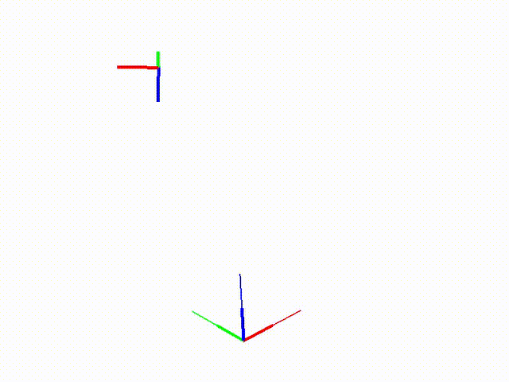

运动学仿真器
==================

RPCP中采用 **RPS.RobotVis** 进行机器人和环境的仿真显示，除此之外还支持其他图形绘制，3D模型导入，人机界面交互等功能，旨在让机器人应用开发更简单高效

RobotVis基础图形绘制
----------------------
运行以下代码，可以在RPCP的运动学仿真器中绘制各种基础图形或者是自定义的mesh

.. code-block:: python

    import numpy as np
    from RVLab import RPS
    from IPython import embed

    # 打开运动学仿真器
    rvis = RPS.RobotVis()
    # 获取绘图viewer对象
    viewer = rvis.GetView()

    # 绘制地面并返回handle
    h = viewer.Ground(halfcells=10, cellsize=0.3, color=[0,0,0])

    # 绘制箭头并返回handle
    h = viewer.Arrow(tail=[0.1,0,0], head=[0.3,0.2,0.3], radius=0.01, colors=[1,0,0])
    embed()
    # 删除指定handle
    viewer.Delete(h)

    # 绘制坐标系并返回handle
    p = RPS.Pose.RandomStatic()
    h = viewer.Axes(pos=p.GetR3().Coeffs().tolist(), quat=p.GetSO3().Coeffs().tolist(), axis_len=0.2, axis_size=3)
    embed()
    viewer.Delete(h)

    # 方法2
    h = rvis.PlotFrame(pose=p, axis_len=0.1, axis_size=2)
    embed()
    viewer.Delete(h)

    # 绘制方盒并返回handle
    h = viewer.Box(pos=[0,0,0], extents=[0.3,0.6,0.3], colors=[0,1,0])
    embed()
    viewer.Delete(h)

    # 绘制圆柱并返回handle
    h = viewer.Cylinder(center=[0,0,0], radius=0.03, height=0.3, colors=[0,0,1])
    embed()
    viewer.Delete(h)

    # 视角回原位
    viewer.Home()

    # 绘制一条线段并返回handle
    h = viewer.Line(lines=[0,0,0,0.2,0.2,0], size=2.0, colors=[0,1,0])
    embed()
    viewer.Delete(h)

    # 绘制多条线段并返回handle
    h = viewer.Line(lines=[-0.2,0,0,-0.2,0.2,0,-0.2,0.2,0,-0.2,0.2,0.2], size=2.0, colors=[0,1,0])
    embed()
    viewer.Delete(h)

    # 绘制mesh并返回handle
    h = viewer.Mesh(vertices=[0.0, 0.0, 0.0,1.0, 0.0, 0.0,1.0, 1.0, 0.0,0.0, 1.0, 0.0], indices=[0, 1, 2,0, 2, 3], colors=[1.0, 0.0, 0.0])
    embed()
    viewer.Delete(h)

    # 绘制一个点并返回handle
    h = viewer.Point(xyzs=[0.2,0.2,0.2], ptsize=5.0, colors=[0,0,1])
    embed()
    viewer.Delete(h)

    # 绘制多点并返回handle
    h = viewer.Point(xyzs=[0.2,0.2,0.2, -0.2,0.2,0.2, -0.2,-0.2,0.2], ptsize=5.0, colors=[0,0,1])
    embed()
    viewer.Delete(h)

    # 绘制球并返回handle
    h = viewer.Sphere(center=[0.1,0.1,0.1], radius=0.1, color=[1.0, 0.0, 0.0, 1.0])
    embed()
    viewer.Delete(h)

.. image:: ../../_static/imgs/02_use_robotvis_00.gif
   :alt: RobotVis绘制图形
   :align: center

RobotVis与位姿变换
---------------------
RobotVis可以方便地显示坐标系，所以经常被用来学习和验证位姿变换，下面的案例展示了Pose的插值，并将Pose的插值过程通过仿真器显示出来

.. code-block:: python

    import time
    import numpy as np
    from RVLab import RPS
    from IPython import embed

    # 打开运动学仿真器
    rvis = RPS.RobotVis()

    p0 = RPS.Pose()

    p1 = RPS.Pose.RandomStatic()

    rvis.PlotFrame(pose=p0, axis_len=0.1, axis_size=5)
    rvis.PlotFrame(pose=p1, axis_len=0.1, axis_size=5)

    embed()
    for i in range(50):
        p = p0 + (p1-p0) * i / 50.0
        rvis.PlotFrame(pose=p, axis_len=0.1, axis_size=2)
        time.sleep(0.05)

    embed()

上面的案例在插值过程中，位置与姿态同时插值，空间中形成一条从起点到终点的曲线，如果想实现空间直线插值，可以采用如下方式

.. code-block:: python

    import time
    import numpy as np
    from RVLab import RPS
    from IPython import embed

    # 打开运动学仿真器
    rvis = RPS.RobotVis()

    p0 = RPS.Pose()

    p1 = RPS.Pose.RandomStatic()

    rvis.PlotFrame(pose=p0, axis_len=0.1, axis_size=5)
    rvis.PlotFrame(pose=p1, axis_len=0.1, axis_size=5)

    embed()
    for i in range(50):
        pos = p0.GetR3() + (p1.GetR3()-p0.GetR3()) * i / 50.0
        quat = p0.GetSO3() + (p1.GetSO3()-p0.GetSO3()) * i / 50.0
        p = RPS.Pose(pos,quat)
        rvis.PlotFrame(pose=p, axis_len=0.1, axis_size=2)
        time.sleep(0.05)

    embed()

.. image:: ../../_static/imgs/02_use_robotvis_02.gif
   :alt: Pose插值(位置与姿态分开插值)
   :align: center