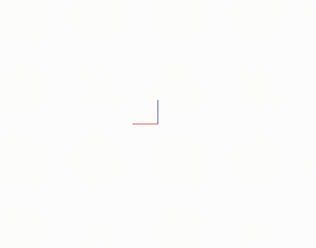

RigidBody和Environment
=============================

前面两个教程分别介绍了如何创建使用机器人模型 :doc:`03_use_robotmodel` 和末端执行器 :doc:`04_use_endeffector`，本节介绍如何创建环境中的其他刚体障碍物RigidBody。

机器人RobotModel、末端执行器EndEffector和刚体障碍物RigidBody共同构成了机器人开发所需的环境Environment。

创建并使用RigidBody
-----------------------
以下代码展示创建多种不同类型的障碍物,除了RPCP中自定义的基础障碍物类型比如长方体，圆柱等，还支持从外部导入STL模型文件，以及导入点云文件作为环境障碍物

.. code-block:: python

    import random
    import numpy as np
    from RVLab import RPS
    from IPython import embed

    rvis = RPS.RobotVis()
    embed()

    # 创建新障碍物box
    box = RPS.RigidBody()
    # box初始化为长方体，指定长宽高
    box.InitFromBox(length=0.2, width=0.4, height=0.1)
    # 将box障碍物加入仿真器
    rvis.AddBody(box)
    embed()
    # 设置box颜色
    rvis.SetColor(box,color=[random.random() for _ in range(3)])
    embed()
    # 修改box的位置和姿态
    box.SetBaseTransformation(RPS.Pose.RandomStatic())
    # 打印RigidBody的位置和姿态
    print(box.GetBaseTransformation())
    embed()

    # 创建新障碍物capsule
    capsule = RPS.RigidBody()
    # capsule初始化为胶囊
    capsule.InitFromCapsule(height=0.3, radius=0.08)
    # 将capsule障碍物加入仿真器
    rvis.AddBody(capsule)
    embed()
    # 设置capsule颜色
    rvis.SetColor(capsule,color=[random.random() for _ in range(3)])
    embed()
    # 修改capsule的位置和姿态
    capsule.SetBaseTransformation(RPS.Pose.RandomStatic())
    embed()

    # 创建新障碍物cylinder
    cylinder = RPS.RigidBody()
    # cylinder初始化为胶囊
    cylinder.InitFromCylinder(radius=0.08, height=0.3)
    # 将cylinder障碍物加入仿真器
    rvis.AddBody(cylinder)
    embed()
    # 设置cylinder颜色
    rvis.SetColor(cylinder,color=[random.random() for _ in range(3)])
    embed()
    # 修改cylinder的位置和姿态
    cylinder.SetBaseTransformation(RPS.Pose.RandomStatic())
    embed()

    # 创建新障碍物container_box
    container_box = RPS.RigidBody()
    # container_box初始化为容器箱子， alpha_l, beta_w, gamma_h分别是容器的壁厚
    container_box.InitFromContainerBox(length=0.2, width=0.4, height=0.1, alpha_l=0.01, beta_w=0.01, gamma_h=0.01)
    # 将container_box障碍物加入仿真器
    rvis.AddBody(container_box)
    embed()
    # 设置container_box颜色
    rvis.SetColor(container_box,color=[random.random() for _ in range(3)])
    embed()
    # 修改container_box的位置和姿态
    container_box.SetBaseTransformation(RPS.Pose.RandomStatic())
    embed()

    # 创建新障碍物sphere
    sphere = RPS.RigidBody()
    # sphere初始化为胶囊
    sphere.InitFromSphere(radius=0.1)
    # 将sphere障碍物加入仿真器
    rvis.AddBody(sphere)
    embed()
    # 设置sphere颜色
    rvis.SetColor(sphere,color=[random.random() for _ in range(3)])
    embed()
    # 修改sphere的位置和姿态
    sphere.SetBaseTransformation(RPS.Pose.RandomStatic())
    embed()

    # 创建新障碍物stl_mesh
    stl_mesh = RPS.RigidBody()
    # stl_mesh从stl文件初始化
    stl_mesh.InitFromMeshFile('./source/_static/model/MeshFile/1.stl')
    # 将stl_mesh障碍物加入仿真器
    rvis.AddBody(stl_mesh)
    embed()
    # 设置stl_mesh颜色
    rvis.SetColor(stl_mesh,color=[random.random() for _ in range(3)])
    embed()
    # 修改stl_mesh的位置和姿态
    stl_mesh.SetBaseTransformation(RPS.Pose.RandomStatic())
    embed()

    # 创建新障碍物pc1
    pc1 = RPS.RigidBody()
    # 随机生成点云坐标，数量必须是3的倍数
    points = [random.random() for _ in range(9000)]
    # 用点云初始化pc1
    pc1.InitFromPointCloud(point_cloud=points, resolution=0.005, cal_octomap=True)
    # 将pc1障碍物加入仿真器
    rvis.AddBody(pc1)
    embed()
    # 修改pc1的位置和姿态
    pc1.SetBaseTransformation(RPS.Pose.RandomStatic())
    embed()

    # 创建新障碍物pc2
    pc2 = RPS.RigidBody()
    # 用ply点云文件初始化pc2
    pc2.InitFromPointCloudFile('./source/_static/model/MeshFile/1.ply',resolution=0.005, cal_octomap=True)
    # 将pc2障碍物加入仿真器
    rvis.AddBody(pc2)
    embed()
    # 修改pc2的位置和姿态
    pc2.SetBaseTransformation(RPS.Pose.RandomStatic())
    embed()

创建并使用Environment
------------------------
之前介绍的RobotModel，EndEffector以及所有的RididBody都是最终加入到环境Environment中的一个个对象，环境Environment用于管理这些对象。
环境中记录了任意两个物体之间的空间变换，此外，它为机器人的运动规划和控制提供了几乎所有必要的信息。

虽然在之前的教程中没有显示地调用Environment，但是在RobotVis中已经使用了Environment，RobotVis仿真器中所显示的内容就是Environment所包含的所有对象,
当RobotVis第一次调用AddBody时，会自动在RobotVis内部创建并维护一个Environment。RobotVis的AddBody函数本质上是将对象添加到内部的Environment中。

下面代码介绍了Environment的功能和使用方法

.. code-block:: python

    import random
    import numpy as np
    from RVLab import RPS
    from IPython import embed

    # 创建一个空的Environment
    env = RPS.Environment()

    rvis = RPS.RobotVis()
    # 将env加载到RobotVis中
    rvis.LoadEnvironment(env)
    # 如果不调用LoadEnvironment函数，直接调用AddBody函数，则RobotVis内部会自动创建一个Environment

    # 创建机器人RobotModel对象
    robot_model = RPS.RobotModel()
    robot_model.InitFromFile('./source/_static/model/RobotModel/GP12.robot')
    manip = robot_model.GetActiveManipulator()

    # 创建新的末端执行器EndEffector对象
    eef = RPS.EndEffector()
    # 末端执行器从二进制文件进行初始化
    eef.InitFromFile('./source/_static/model/EndEffector/FourFingerVacuumPads.eef')
    # 将末端执行器安装到manip末端
    manip.SetActiveEndEffector(eef)
    # 设置末端执行器的安装位置姿态
    eef.SetAttachingPose(RPS.Pose(0,0,0,0,0,0))
    
    env.AddBody(robot_model) # 与rvis.AddBody(robot_model)等效

    # 创建新障碍物box
    box = RPS.RigidBody()
    box.InitFromBox(length=0.2, width=0.4, height=0.1)
    box.SetBaseTransformation(RPS.Pose.RandomStatic())
    env.AddBody(box)
    embed()
    
    # 创建新障碍物capsule
    capsule = RPS.RigidBody()
    capsule.InitFromCapsule(height=0.3, radius=0.08)
    capsule.SetBaseTransformation(RPS.Pose.RandomStatic())
    env.AddBody(capsule)
    embed()

    # 移除box
    env.RemoveBody(box)
    embed()

    # 获取环境中的RobotModel
    robot_models = env.GetRobotModels()

    assert robot_models[0] == robot_model

    # 打印环境中的碰撞检测矩阵
    print(env.GetCollisionMatrix())
    
    embed()
    

