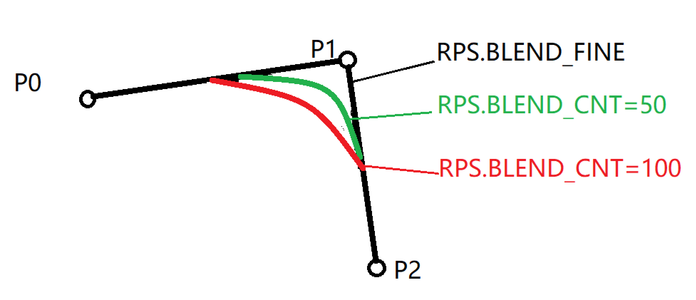
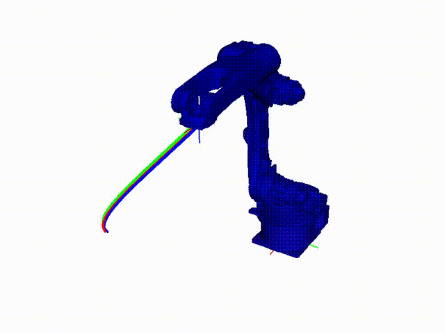

机器人虚拟控制器
=============================

前面我们介绍了RPCP中的基本概念和基础模块工具，本节介绍机器人的控制模块Controller，学习完这些基础工具，就可以进行一些简单场景下的机器人应用开发。

虚拟控制器的基本使用方法
--------------------------
为了方便开发者在不连接实际机器人的情况下可以进行机器人代码开发与调试，RPCP提供了和真实控制器功能一样的虚拟控制器用于控制仿真器中的机器人。虚拟控制器
和后面高级模块中要介绍的真实控制器保证接口一致，控制效果一致，当开发者基于虚拟控制器完成代码的调试后，可以通过 **一行代码替换** 完成仿真到实机的切换。

下面代码介绍了如何创建和使用虚拟控制器

.. code-block:: python

    import numpy as np
    from RVLab import RPS
    from IPython import embed

    robot_model = RPS.RobotModel()
    robot_model.InitFromFile('./source/_static/model/RobotModel/GP12.robot')
    manip = robot_model.GetActiveManipulator()
    rvis = RPS.RobotVis()
    rvis.AddBody(robot_model)

    # 创建非实时伺服控制器，is_servo_controller=False表示不支持实时伺服控制，实时伺服控制器会在后面的高级模块章节中介绍
    controller = RPS.SimController.Create(manip,is_servo_controller=False)

    # 打印当前控制器状态信息, 因为控制器刚创建，所以当前应该是处于初始化状态：RPS.ControllerStatus_Init
    print(controller.GetStateMachine().GetStatus())
    
    # 通过机器人IP连接机器人
    res = controller.Connect('127.0.0.1')
    if res != RPS.RVSReturn_Success:
        raise RuntimeError('连接机器人失败')

    # 打印当前控制器状态信息, 连接成功后，当前应该是处于连接状态：RPS.ControllerStatus_Connect
    print(controller.GetStateMachine().GetStatus())

    # 打印自由度信息
    print("controller dof: ", controller.GetDoF())

    # 获取数字输入DI1的信息
    res, io_data = controller.GetIO(address=1, io_type=RPS.IOType_DI)
    if res != RPS.RVSReturn_Success:
        raise RuntimeError('获取DI1信息失败')
    # 除了支持数字输入信息，还支持数字输出DO，模拟输入AI，模拟输出AO，组输入GI，组输出GO等

    # 设置数字输出DO1为True
    res = controller.SetIO(address=1, value=1.0, io_type=RPS.IOType_DO)
    if res != RPS.RVSReturn_Success:
        raise RuntimeError('设置DO状态失败')
    # 设置数字输出DO1为False
    res = controller.SetIO(address=1, value=0.0, io_type=RPS.IOType_DO)
    if res != RPS.RVSReturn_Success:
        raise RuntimeError('设置DO状态失败')

    # 获取当前关节位置信息
    res, curr_q = controller.GetJointPositions()
    if res != RPS.RVSReturn_Success:
        raise RuntimeError('获取关节位置信息失败')
    
    # 获取当前机器人末端的位置姿态信息
    res, curr_p = controller.GetPose()
    if res != RPS.RVSReturn_Success:
        raise RuntimeError('获取末端位置信息失败')

    # 获取当前运动速率信息
    res, speed_ratio = controller.GetSpeedRatio()
    if res != RPS.RVSReturn_Success:
        raise RuntimeError('获取运动速率失败')
    
    # 设置controller的运动速率(0-1]
    res = controller.SetSpeedRatio(0.2)
    if res != RPS.RVSReturn_Success:
        raise RuntimeError('设置运动速率失败')

    # 获取当前TCP信息
    res, tcp = controller.GetTCP()
    if res != RPS.RVSReturn_Success:
        raise RuntimeError('获取tcp信息失败')

    # 设置TCP状态
    res = controller.SetTCP(RPS.Pose(0,0,0.1,0,0,0))
    if res != RPS.RVSReturn_Success:
        raise RuntimeError('设置tcp失败')

    # 上使能机器人
    res = controller.EnableRobot()
    if res != RPS.RVSReturn_Success:
        raise RuntimeError('上使能失败')
    
    # 打印当前控制器状态信息, 使能成功后，当前应该是处于连接状态：RPS.ControllerStatus_Enable
    print(controller.GetStateMachine().GetStatus())

    # 下使能机器人
    res = controller.DisableRobot()
    if res != RPS.RVSReturn_Success:
        raise RuntimeError('下使能失败')

    # 打印当前控制器状态信息, 连接成功后，当前应该是处于连接状态：RPS.ControllerStatus_Connect
    print(controller.GetStateMachine().GetStatus())

    # 断开连接机器人
    res = controller.Disconnect()
    if res != RPS.RVSReturn_Success:
        raise RuntimeError('断开连接机器人失败')

    # 打印当前控制器状态信息, 因为控制器刚创建，所以当前应该是处于初始化状态：RPS.ControllerStatus_Init
    print(controller.GetStateMachine().GetStatus())

    embed()

机器人的目标点位表示方法：SimpleMotionData
------------------------------------------
本节使用的非实时伺服控制器，采用RPS.SimpleMotionData数据结构来表示机器人运动的目标点位及其行为，SimpleMotionData的完整定义如下

.. code-block:: python

    RPS.SimpleMotionData(
        seq: int, 
        target_values: List[float], 
        motion_type: RPS.MOTION_J, 
        speed_type: RPS.SPEED_PERCENTAGE, 
        speed_value: float = 30, 
        blend_type: RPS.BLEND_CNT, 
        blend_value: float = 100, 
        wait_time: float = 0.0
    )

- seq： 用于标记多个运动目标的顺序一般从1开始，有多个目标点位时逐步递增  
  
- target_values： 传入python List数据，当前支持输入目标位置处机器人的关节位置 
  
- motion_type： 机器人运动到该点位的插值方式，支持关节插值RPS.MOTION_J和笛卡尔插值RPS.MOTION_L，如果不填写则使用默认值RPS.MOTION_J 
  
- speed_type： 机器人运动到该点位的速度方式，需要根据插值类型搭配使用，如果不填写默认值是百分比速度RPS.SPEED_PERCENTAGE
  
      - RPS.SPEED_PERCENTAGE： 表示百分比速度
      - RPS.SPEED_TIME： 表示时间(秒)
      - RPS.SPEED_MM_S： 表示末端线速度(毫米/秒)
      - RPS.SPEED_DEG_S： 表示末端角速度(度/秒)

      * 如果插值方式是RPS.MOTION_J，支持RPS.SPEED_PERCENTAGE和RPS.SPEED_TIME
      * 如果插值方式是RPS.MOTION_L，支持RPS.SPEED_MM_S和RPS.SPEED_TIME
      * 如果该点只是绕着机器人的TCP点旋转，没有线速度，支持RPS.SPEED_DEG_S和RPS.SPEED_TIME

- speed_value： 具体速度值

      * 如果速度类型是RPS.SPEED_PERCENTAGE，则表示具体百分比，范围(0-100]，例如80表示用机器人最大速度的80%运动到目标位置
      * 如果速度类型是RPS.SPEED_TIME，则表示运动时间，例如2表示用两秒运动到目标位置
      * 如果速度类型是RPS.SPEED_MM_S，则表示末端线速度(毫米/秒)，例如300表示末端保持匀速300mm/s的速度运动到目标点
      * 如果速度类型是RPS.SPEED_DEG_S，则表示末端角速度(度/秒)，例如20表示末端保持匀速20度/s的速度运动到目标点
  
- blend_type： 中间点过渡类型，当目标点位数量大于等于2时生效，当只有一个目标点位不生效。过渡类型分为精准到达RPS.BLEND_FINE和接近RPS.BLEND_CNT两种类型，二者的区别如下图，其中BLEND_FINE表示精准到达目标点，但是会造成运动过程中的减速停止和重新加速，影响整体效率，BLEND_CNT表示用曲线过渡的方式以一定的过渡半径不停止地通过中间点。CNT数值越大过渡半径越大。

- blend_value： 过渡半径，只有当blend_type为BLEND_CNT时生效。取值范围[0-100]，只表示相对大小，具体的过渡半径根据不同的机器人品牌而定。
- wait_time： 表示机器人到达该点后的停留时间(秒)，默认为0.0即不停留

下面的代码介绍了如何用RPS.SimpleMotionData定义目标点位，同时调用非实时伺服控制器的运动控制接口实现运动控制

.. code-block:: python

    import time
    import numpy as np
    from RVLab import RPS
    from IPython import embed

    robot_model = RPS.RobotModel()
    robot_model.InitFromFile('./source/_static/model/RobotModel/GP12.robot')
    manip = robot_model.GetActiveManipulator()
    rvis = RPS.RobotVis()
    rvis.AddBody(robot_model)

    # 创建非实时伺服控制器，is_servo_controller=False表示不支持实时伺服控制，实时伺服控制器会在后面的高级模块章节中介绍
    controller = RPS.SimController.Create(manip,is_servo_controller=False)
    
    # 通过机器人IP连接机器人
    res = controller.Connect('127.0.0.1')
    if res != RPS.RVSReturn_Success:
        raise RuntimeError('连接机器人失败')

    # 上使能机器人
    res = controller.EnableRobot()
    if res != RPS.RVSReturn_Success:
        raise RuntimeError('上使能失败')

    # 修改不同的全局运动速率查看效果
    res = controller.SetSpeedRatio(1)
    if res != RPS.RVSReturn_Success:
        raise RuntimeError('设置运动速率失败')
    # 全局运动速率是指在每个target自己的运动速度基础上再乘以全局运动速率系数
    
    embed()
    # 定义目标位置1
    target1 = RPS.SimpleMotionData( seq=1, # 点位序号
                                    target_values=[-0.660838, 0.687775, -0.425342, 5.02834e-06, -0.457682, 0.660834],
                                    )
    # 下发运动指令，wait=True表示该函数等待运动执行完毕后再返回
    # 如果只执行单个点位，则seq不生效
    res = controller.ExecuteWaypoints([target1],wait=True)    
    if res != RPS.RVSReturn_Success:
        raise RuntimeError('运动失败')
    
    embed()
    # 定义目标位置2，用笛卡尔插值方式运动，设定末端匀速400mm/s
    target2 = RPS.SimpleMotionData( seq=2, # 点位序号
                                    target_values=[-0.660837, 0.307805, 0.121503, 2.26099e-06, -1.3845, 0.660836], 
                                    motion_type=RPS.MOTION_L, 
                                    speed_type=RPS.SPEED_MM_S, 
                                    speed_value=400
                                    )
    res = controller.ExecuteWaypoints([target2],wait=True)    
    if res != RPS.RVSReturn_Success:
        raise RuntimeError('运动失败')

    embed()
    # 定义目标位置3，设定运行时间3s
    target3 = RPS.SimpleMotionData( seq=3,
                                    target_values=[0,0,0,0,-1.5708,0],
                                    motion_type=RPS.MOTION_J,
                                    speed_type=RPS.SPEED_TIME, 
                                    speed_value=3
                                    )
    res = controller.ExecuteWaypoints([target3],wait=True)    
    if res != RPS.RVSReturn_Success:
        raise RuntimeError('运动失败')

    embed()
    # 三个点位一起执行，wait=True表示该函数等待运动执行完毕后再返回
    res = controller.ExecuteWaypoints([target1,target2,target3],wait=True)    
    if res != RPS.RVSReturn_Success:
        raise RuntimeError('运动失败')

    embed()
    # 采用非阻塞模式执行运动指令,该函数会立刻返回
    res = controller.ExecuteWaypoints([target1,target2,target3],wait=False)    
    if res != RPS.RVSReturn_Success:
        raise RuntimeError('运动失败')

    # 通过一直循环检查机器人是否处于RPS.ControllerStatus_Working状态，判断机器人是否到位
    while controller.GetStateMachine().GetStatus() == RPS.ControllerStatus_Working:
        time.sleep(0.1)
    print("机器人运动完毕，当前机器人控制器状态： ", controller.GetStateMachine().GetStatus())

    embed()

更快捷的控制调试接口
--------------------------
上面介绍了RPCP中采用SimpleMotionData的数据结构来定义机器人的每个路径点，通过这种方式用户可以实现对每个路径点行为的完全灵活定义，关于更多的SimpleMotionData高级参数，会在高级教程中介绍。
但是如果开发者想在开发过程中快速调试机械臂，可以采用 **RPS.BasicMotionUtilities** 模块实现一行代码控制机器人。RPS.BasicMotionUtilities本质上是对SimpleMotionData进行了部分封装，
降低了用户控制机器人行为的灵活性但是加快了调试速度

.. code-block:: python

    import numpy as np
    from RVLab import RPS
    from IPython import embed

    robot_model = RPS.RobotModel()
    robot_model.InitFromFile('./source/_static/model/RobotModel/GP12.robot')
    manip = robot_model.GetActiveManipulator()
    rvis = RPS.RobotVis()
    rvis.AddBody(robot_model)

    # 创建非实时伺服控制器，is_servo_controller=False表示不支持实时伺服控制，实时伺服控制器会在后面的高级模块章节中介绍
    controller = RPS.SimController.Create(manip,is_servo_controller=False)
    # 传入controller创建BasicMotionUtilities
    basic_motion = RPS.BasicMotionUtilities(controller)
    
    # 通过机器人IP连接机器人
    res = controller.Connect('127.0.0.1')
    if res != RPS.RVSReturn_Success:
        raise RuntimeError('连接机器人失败')

    # 上使能机器人
    res = controller.EnableRobot()
    if res != RPS.RVSReturn_Success:
        raise RuntimeError('上使能失败')
    
    embed()
    # MoveJoints关节空间运动插值，默认采用机器人约束内的最大速度
    res = basic_motion.MoveJoints(RPS.Rx([-0.660838, 0.687775, -0.425342, 5.02834e-06, -0.457682, 0.660834]),wait=True)
    if res != RPS.RVSReturn_Success:
        raise RuntimeError('运动失败')
    # 记录当前末端的pose
    p1 = controller.GetPose()[1]

    embed()
    # MoveLinear笛卡尔空间运动插值，默认采用机器人约束内的最大速度
    res = basic_motion.MoveLinear(RPS.Rx([-0.660837, 0.307805, 0.121503, 2.26099e-06, -1.3845, 0.660836]),wait=True)
    if res != RPS.RVSReturn_Success:
        raise RuntimeError('运动失败')
    # 记录当前末端的pose
    p2 = controller.GetPose()[1]

    # 修改全局运动速率，全局速率控制依然生效
    res = controller.SetSpeedRatio(0.5)
    if res != RPS.RVSReturn_Success:
        raise RuntimeError('设置运动速率失败')

    embed()
    # MoveJoints关节空间运动插值，默认采用机器人约束内的最大速度
    res = basic_motion.MoveJoints(RPS.Rx([0,0,0,0,-1.5708,0]),wait=True)
    if res != RPS.RVSReturn_Success:
        raise RuntimeError('运动失败')
    # 记录当前末端的pose
    p3 = controller.GetPose()[1]

    # BasicMotionUtilities的另一个方便之处在于支持输入pose形式的target，而SimpleMotionData目前只支持输入关节点位
    # 下方三个指令输入末端pose
    basic_motion.MoveJoints(p1,wait=True)
    basic_motion.MoveJoints(p2,wait=True)
    basic_motion.MoveJoints(p3,wait=True)

    # 除此之外BasicMotionUtilities还可以令机器人末端做笛卡尔增量运动
    # 沿着机器人基坐标系X轴正方形运动0.1米
    basic_motion.MoveBX(0.1)
    # MoveBY，MoveBZ同理

    # 沿着机器人TCP坐标系X轴副方向运动0.1米
    basic_motion.MoveTX(-0.1)
    # MoveTY，MoveTZ同理

    # 绕着机器人基坐标系X轴正方向旋转0.1弧度
    basic_motion.RotateBX(0.1)
    # RotateBY,RotateBZ同理

    # 绕着机器人TCP坐标系X轴正方向旋转0.1弧度
    basic_motion.RotateTX(0.1)
    # RotateTY,RotateTZ同理
    
    embed()

注意
----------

当使用真实控制器时，只需要修改创建控制器这一行代码，其他代码均与虚拟控制器一致。真实控制器的创建会在高级教程章节介绍。